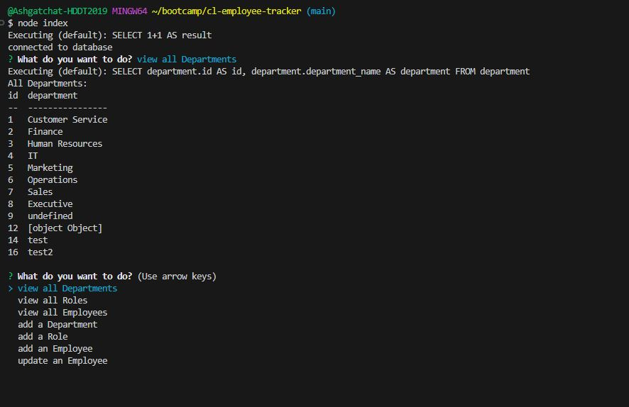
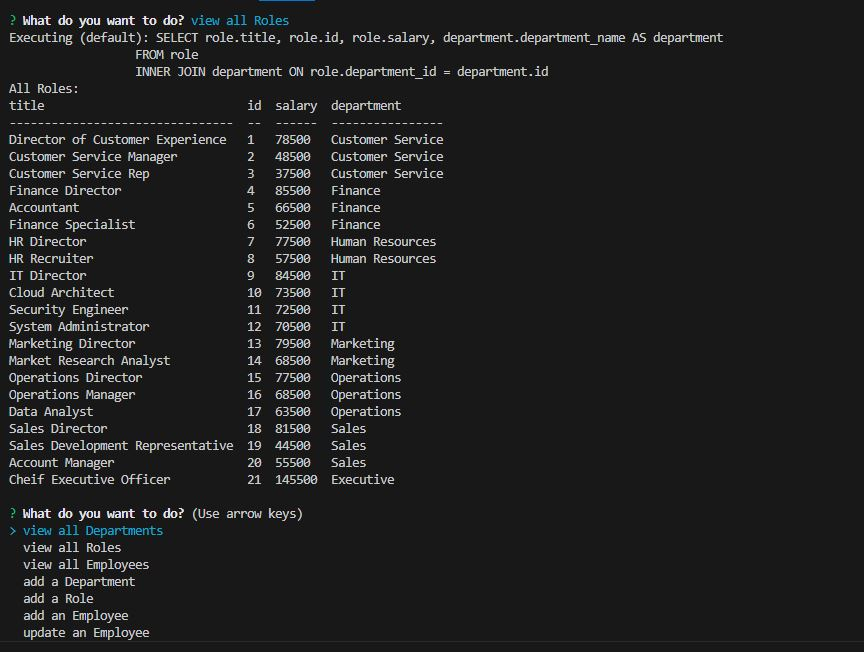
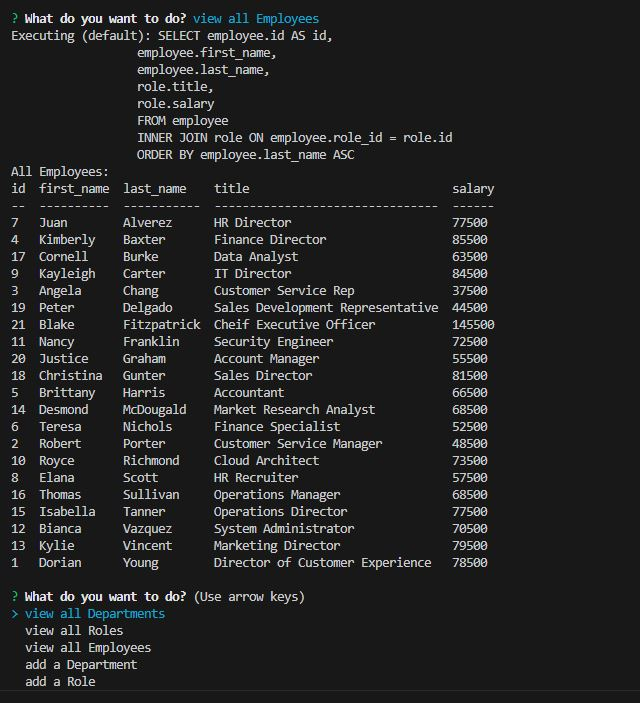

# cl-employee-tracker

## Description

I was motivated to do this challenge as part of my bootcamp week12 challenge. This solves the problem of tracking employees in a professional automated way. I learned how to more effenciently use node.js, inquier, and PostgrSQL.

([Link to video walkthrough](https://drive.google.com/file/d/1QdZqISc7HNQ5w4_eYaOGXd2xfDPzHYKl/view?usp=sharing))

([Code source location](https://github.com/Ashleighjg/cl-employee-tracker))

## Table of Contents

- [Installation](#installation)
- [Usage](#usage)
- [License](#license)
- [Contributing](#contributing)
- [Tests](#tests)
- [Questions](#questions)

## Installation

N/A

## Usage

This employee tracker can be used by developers and programmers to develop an app for tracking employees.

Once the user has run "node index" in the terminal and input responses to the prompted questions, there will be a queries ran to update the employee database.

## License

This project is licensed under the ([MIT](https://opensource.org/licenses/MIT)) license.

## Contributing

Portions of this code is sourced from Xpert Learning Assistant.

([Xpert Learning Assistant](https://bootcampspot.instructure.com/courses/6022/external_tools/313))

## Tests

N/A

## Questions

If you have any questions you can email me at Ashleighjg@gmail.com or contact me via Github username Ashleighjg.
